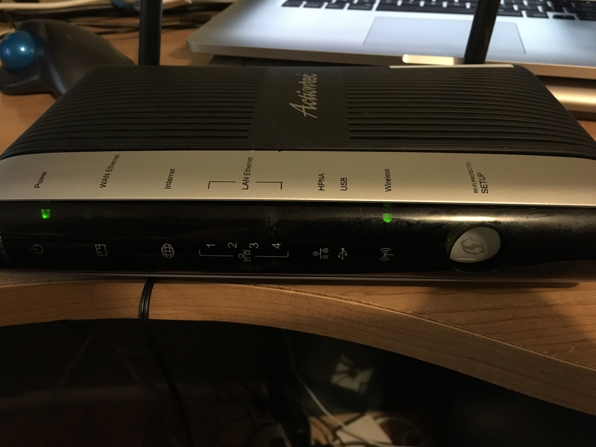
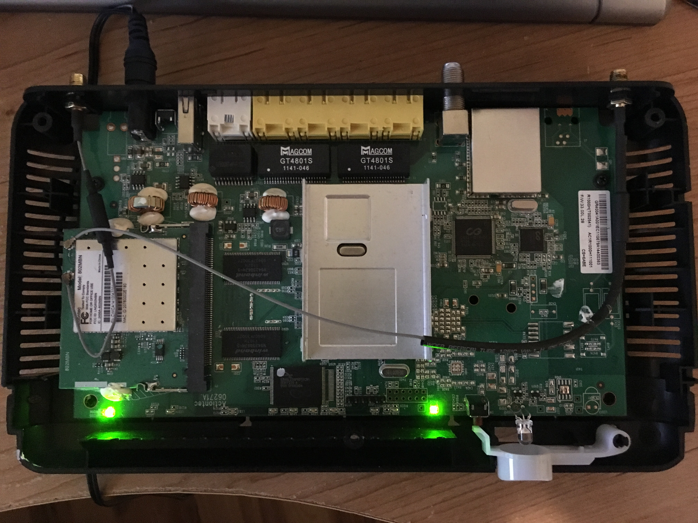
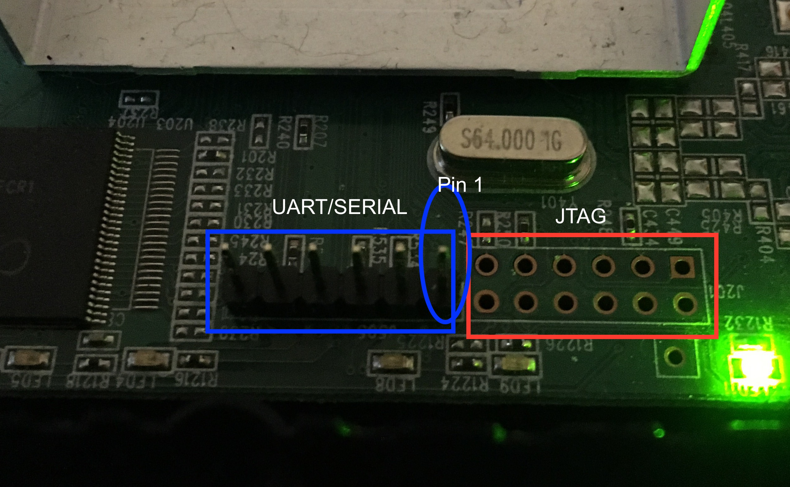
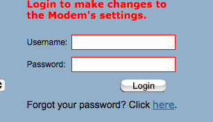
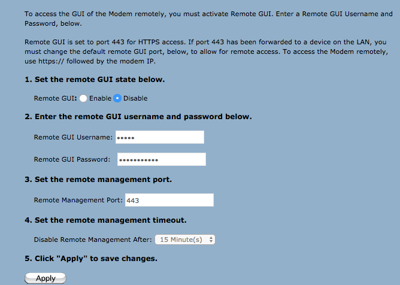
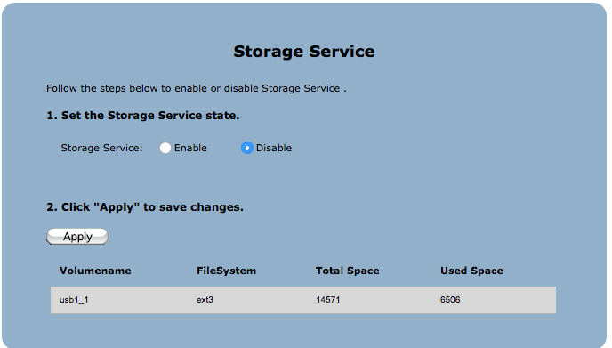
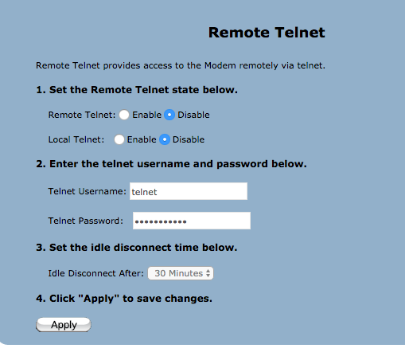
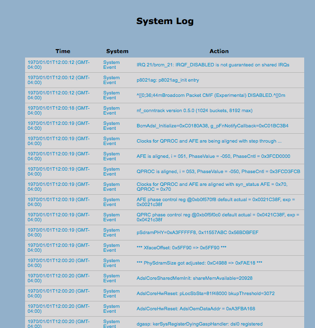
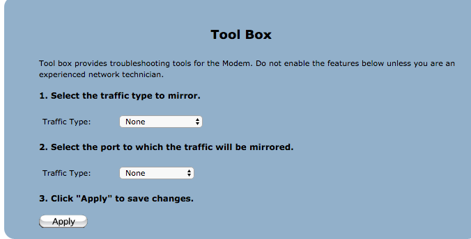
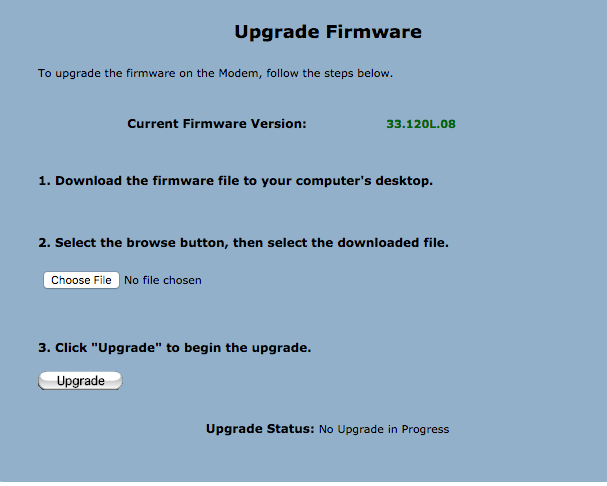

# Actiontec R1000H

Vulnerability Research of Actiontec R1000H and R3000 ISP provider routers. Some of this COULD apply to other Actiontec APs in North America, however UNABLE TO VERIFY.

## Table of Contents

- [Motivation](#motivation)
- [Device Specs](#device-specs)

<div id='motivation'/>

## Motivation

------

ISP provided router, and I thought I had complete control over it. I had altered the administrative username and password, modified the firewall rules to be extremely restrictive.

Had to call the ISP to get some help on configuring it at one point, and then they said the could reset it to 'factory' defaults remotely. Fascinated I wondered how. This is how I learned about the existence of TR-069.

Not liking this at all, I had decided to build my own router on a *nix box, but had to learn how the router was operated. We had IPTV through the device and multicast routing via VLAN with priority tagging wasn't an easy thing to accomplish. Putting this project aside while I learned more about what options were available to me, I decided I needed more information from the router. This is when I went looking for the firmware.

It seems Actiontec has issues with complying with GPL rules, so I decided I had no choice. Time to break into the router. This is the documentation of the work and what has been discovered so far.

<div id ='device-specs'/>

## Device Specs

------





Wireless N Gigabit Router

4 x Gig Ethernet LAN ports, 1 x Gig Ethernet WAN port, 1 x HPNA port (Coax), 1 x USB 2.0 for shared storage

<div id ='real-details'/>

### REAL DETAILS

```bash
######kernel version######
Linux version 2.6.30 (jhenyang@MsgSW4-SerVer) (gcc version 4.4.2 (Buildroot 2010.02-git) ) #1 SMP PREEMPT Thu Feb 7 16:48:18 CST 2013

######wl version######
5.100 RC138.2008
wl0: Feb  7 2013 16:48:44 version 5.100.138.2008.cpe4.12L04.3
vendorid 0x14e4
deviceid 0x4350
radiorev 0x62056000
chipnum 0xa8d6
chiprev 0x0
chippackage 0x8
corerev 0x10
boardid 0x4d2
boardvendor 0x14e4
boardrev P505
driverrev 0x5648a7d
ucoderev 0x2a30835
bus 0x1
phytype 0x4
phyrev 0x6
anarev 0x0

######/proc/cpuinfo######
system type             : 96368MVWG
processor               : 0
cpu model               : Broadcom4350 V3.1
BogoMIPS                : 399.36
wait instruction        : yes
microsecond timers      : yes
tlb_entries             : 32
extra interrupt vector  : no
hardware watchpoint     : no
ASEs implemented        :
shadow register sets    : 1
core                    : 0
VCED exceptions         : not available
VCEI exceptions         : not available
```

<div id ='serial-jtag'/>

## Serial and JTAG locations

------



UART/Serial Pin 1 is the one closet to the JTAG port. This is a 3.3v UART. Settings on your terminal program are 115200, 8N1, No Flow Control (ha! BBS days help again)

* Make sure the Hardware Flow Controll is set to 'OFF' as well, especially when using minicom. *

When connecting your UART/Serial to USB device (cause who has COM ports anymore?), you only need 3 pins to connect.

GROUND, TX, RX

| Pin on board| Function       | UART/Serial Device |
| ------------|:--------------:|:-------------------|
| 1 | GROUND | GROUND |
| 2 | TX | RX |
| 3 | RX | TX |
| 4 | - | - |
| 5 | Power | - |
| 6 | ?? | - |

## Dumping firmware via serial

------


1. Once connected you can start capturing all output to a log file via `minicom`.
1. Run the CFE `dm` command, to dump all the memory.

   This is a hexdump of everything in RAM. It is 64M in size, and contains two full working images, an A and a B version.
   This is likely a failsafe in case of a bad remote upgrade.

1. Once complete, exit `minicom`, edit the file with sed/awk/perl so you just have a valid hexdump file.

   Hexdump should look a little something like this before editing

```
b8000460: 00 00 00 00 00 00 00 00 00 00 00 00 00 00 00 00    ................
b8000470: 00 00 00 00 00 00 00 00 00 00 00 00 00 00 00 00    ................
b8000480: 00 00 00 00 00 00 00 00 00 00 00 00 00 00 00 00    ................
b8000490: 00 00 00 00 00 00 00 00 00 00 00 00 00 00 00 00    ................
b80004a0: 00 00 00 00 00 00 00 00 00 00 00 00 00 00 00 00    ................
b80004b0: 00 00 00 00 00 00 00 00 00 00 00 00 00 00 00 00    ................
b80004c0: 00 00 00 00 00 00 00 00 00 00 00 00 00 00 00 00    ................
b80004d0: 00 00 00 00 00 00 00 00 00 00 00 00 00 00 00 00    ................
b80004e0: 00 00 00 00 00 00 00 00 00 00 00 00 00 00 00 00    ................
b80004f0: 00 00 00 00 00 00 00 00 00 00 00 00 00 00 00 00    ................
b8000500: 00 00 00 00 00 00 00 00 00 00 00 00 00 00 00 00    ................
b8000510: 00 00 00 00 00 00 00 00 00 00 00 00 00 00 00 00    ................
b8000520: 00 00 00 00 00 00 00 00 00 00 00 00 00 00 00 00    ................
b8000530: 00 00 00 00 00 00 00 00 00 00 00 00 00 00 00 00    ................
b8000540: 00 00 00 00 00 00 00 00 00 00 00 00 00 00 00 00    ................
b8000550: 00 00 00 00 00 00 00 00 00 00 00 00 00 00 00 00    ................
b8000560: 00 00 00 00 00 00 00 00 00 00 00 00 00 00 00 00    ................
b8000570: 63 66 65 2d 76 01 00 25 66 09 02 00 00 00 00 00    cfe-v..%f.......
b8000580: 00 00 00 05 65 3d 31 39 32 2e 31 36 38 2e 31 2e    ....e=192.168.1.
b8000590: 31 3a 66 66 66 66 66 66 30 30 20 68 3d 31 39 32    1:ffffff00 h=192
b80005a0: 2e 31 36 38 2e 31 2e 31 30 30 20 67 3d 20 72 3d    .168.1.100 g= r=
b80005b0: 66 20 66 3d 76 6d 6c 69 6e 75 78 20 69 3d 62 63    f f=vmlinux i=bc
b80005c0: 6d 39 36 33 78 78 5f 66 73 5f 6b 65 72 6e 65 6c    m963xx_fs_kernel
b80005d0: 20 64 3d 39 20 70 3d 30 20 00 00 00 00 00 00 00     d=9 p=0 .......
b80005e0: 00 00 00 00 00 00 00 00 00 00 00 00 00 00 00 00    ................
b80005f0: 00 00 00 00 00 00 00 00 00 00 00 00 00 00 00 00    ................
b8000600: 00 00 00 00 00 00 00 00 00 00 00 00 00 00 00 00    ................
b8000610: 00 00 00 00 00 00 00 00 00 00 00 00 00 00 00 00    ................
b8000620: 00 00 00 00 00 00 00 00 00 00 00 00 00 00 00 00    ................
b8000630: 00 00 00 00 00 00 00 00 00 00 00 00 00 00 00 00    ................
b8000640: 00 00 00 00 00 00 00 00 00 00 00 00 00 00 00 00    ................
b8000650: 00 00 00 00 00 00 00 00 00 00 00 00 00 00 00 00    ................
b8000660: 00 00 00 00 00 00 00 00 00 00 00 00 00 00 00 00    ................
b8000670: 00 00 00 00 00 00 00 00 00 00 00 00 00 00 00 00    ................
b8000680: 00 00 00 00 52 31 30 30 30 48 00 00 47 00 00 00    ....R1000H..G...
b8000690: 00 00 00 00 00 00 00 00 00 00 00 40 00 00 00 08    ...........@....
```

4. Quick and diry way
```
cat hex-dump.txt | awk 'BEGIN {s=2; e=17} {for( i = s;  i <= e; i++) printf("%s ",$(i)); }' > hex-dump-only-data.txt
```
ß
5. Using `xxd -r -p` on the new file should give you a binary file that you can use binwalk on and extract the firmware from. Hooray! \o/

TODO: (detail usage of minicom log capturing, awk/sed/perl, xxd -r, binwalk)

6. cat r1000.cap | awk 'BEGIN {s=1; e=17; } {for (i=s; i<=e; i++) printf("%s%s", $(i), i<e ? OFS : "\n");}' > test.cap
7. cat r1000h.memdump.cap | awk 'BEGIN {s=2; e=17;} {for (i=s; i<=e; i++) printf("%s ",$(i));}' > r1000h.memdump-noaddy-repl-test-asdasdadad.dm

## OS Basics

******

The OS is based on [Buildroot](https://buildroot.org/) 2010.02-git version (ulibc based), a Linux 2.6.30 kernel, custom compiled busybox, with Broadcom binary blobs, drivers and binaries for controlling the various components and routing capabilities, while using a customized [micro_httpd]("https://acme.com/software/micro_httpd/") daemon, which has a built in templating system, a set of server side includes for its webpages, and all 'cgi' functions are compiled into the binary.

Seems pretty ripe to me:)

## Discoveries

------

ISP has decided to 'hide' menu options on this particular device. Whatever the marketing decision was (not enough cpu to handle the extra load, oversight, force customers to 'rent' or buy a more expensive device), unreferenced menu items were there. This was discovered after dumping the firmware via the serial port.

**_All of these items are only discoverable once you are authenticated to the device._**

*I'm purposely obfuscating some of this, but those bits are easily discoverable with Google Dorks*

## EXPLOITS

------

### **Remote BUFFER Overflow**

Wha?? Yeah. I can overwrite values in the heap/stack of the httpd (micro_httpd) process. Done at just the right length, without crashing the daemon, I can overwrite values and see them rendered (to a degree) on index.html. If I go further, I can force the daemon to SIG 11. PoC in the works.

### **Remote Shell via SMB - HIDDEN MENU AND EXPLOIT**

This is derived from Andrew Klaus's discovery on the Telus T220H device. While not the same device, and some differences exist between their hardware and firmware, a similar technique that Andrew used works on both the R1000H and the R3000 device. Its not nearly as nice and elegant, but still works. Unlike Andrew's exploit, this DOES NOT require a USB device in the port to work.

Reference: [Actiontec T2200H (Telus Modem) Root Reverse Shell](http://seclists.org/fulldisclosure/2016/Aug/75)


1. Start a listener with netcat on your 'control' host - `nc -l -p 5555`
1. Alter the [mini-server.py](scripts/mini-server.py) 'web' server to point to your 'control' server and run it
1. Alter the [ReverseShell_thur_smb.py](scripts/ReverseShell_thru_smb.py) script to use your 'control' server and run that
1. Hopefully script-rot hasn't set in and these still work.. you should get a reverse shell in your `nc` listener window.


## General Info

------

### **Local/LAN side authentication**



Authentication to the device is strange. It does not use cookies! Once you authenticate on the LAN side of the device, your IP is used as the authorization token.
Thats right. Your IP. You can close your browswer, flush the cache and cookies, open a new browswer altogether or even one from within a VM on that host, and it will work. Unsure as to the timeout value or if this is the same method used if you should happen to accidentally turn on the "Remote GUI" option.

This could be ISP specific, so perhaps only a regional big deal.



### **Image has been built from another ISP's source**

There are hard coded values that refer to the other ISP values and their configs. Firewall settings that open up towards the DNS servers of another ISP in another country.

Hello Centurylink.net!

```text
<ServiceName>DNS&nbsp;CenturyLink</ServiceName>
        <ServiceType>Domain&nbsp;Name&nbsp;Service&nbsp;to/from&nbsp;CenturyLink&nbsp;anycast&nbsp;addresses&nbsp;205.171.3.65&nbsp;205.171.2.65</ServiceType>
        <PortSetting>DNS&nbsp;CenturyLink</PortSetting>
        <X_404A03_ClassName>CenturyLink&nbsp;Video&nbsp;Services</X_404A03_ClassName>
        <X_404A03_ClassName>CenturyLink&nbsp;VoIP</X_404A03_ClassName>
        <X_404A03_ClassName>CenturyLink&nbsp;VoIP&nbsp;Signaling</X_404A03_ClassName>
          <Username notification="2">connect@centurylink.com</Username>```

<X_404A03_DefaultPPPConfig>
      <Enable>TRUE</Enable>
      <Username>connect@centurylink.com</Username>
      <Password>k4rNJMDb</Password>
      <PasswordCHAP>k4rNJMDb</PasswordCHAP>
      <PasswordPAP>k4rNJMDb</PasswordPAP>
      <BackupUsername>(null)</BackupUsername>
      <BackupPassword>(null)</BackupPassword>
```

## HIDDEN MENU OPTIONS

------

### **USB Storage Sharing via SMB - HIDDEN MENU on R1000/Available on R3000**



### **Enable remote telnet/SSH - HIDDEN MENU**

Disabled by default. Navigate to a hidden menu or send the appropriate POST call to the device, with an arbitrarily specified username and password, you can allow your AP to be reached via telnet remotely or locally on your LAN. Why would you want to do this? Don't do this.



### **Syslog - HIDDEN MENU**

Hidden treasure can be found in logs. Especially syslog!

URL: <http://192.168.1.1/syslog.html>



### **Port Mirroring Functions - HIDDEN MENU**

Who needs an expensive switch and network taps??



## **Upgrade your Firmware**

**Don't do this!**



## **See Upgrade History**

This is why those of us whom are capable would rather run our own out-dated software on our network INGRES/EGRESS points.


